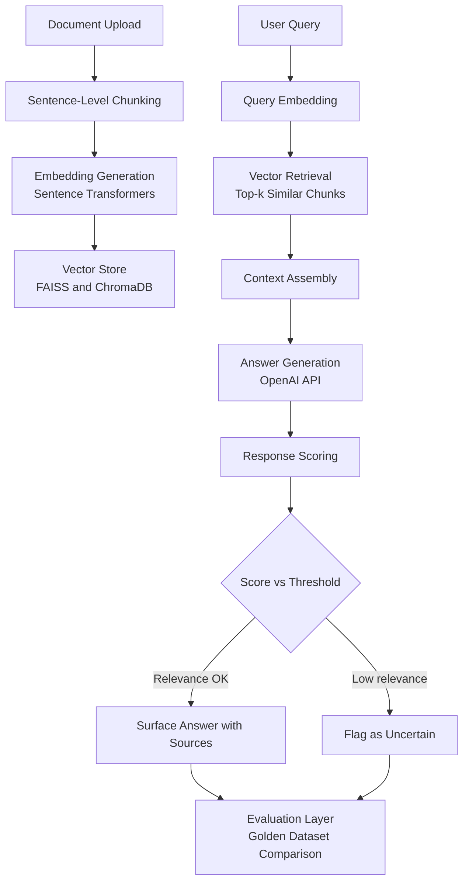

# RAG Knowledge Assistant with Retrieval Evaluation

[](https://github.com/Avvv19/rag-search-answer-evaluation-assistant/actions/workflows/ci.yml)
[](https://www.python.org/downloads/)

Indexes uploaded documents with sentence-level chunking and vector retrieval. Returns grounded answers with source context. Scores each response against a fixed golden evaluation set of 25 representative questions.

---

## Architecture



---

## Evaluation approach

The system is evaluated against a fixed golden set of 25 representative questions covering factual extraction, summarization, edge cases, and multi-paragraph synthesis. Each response is scored on three dimensions:

- **Relevance**: did the retrieval surface appropriate chunks
- **Source coverage**: were expected document sections retrieved
- **Unsupported answer risk**: does the answer go beyond the sources

Run the evaluation suite:

```bash
python evaluation/run_eval.py
```

### Golden set categories

| Category | Count | Description |
|---|---|---|
| Direct retrieval | 5 | Exact keyword or clause lookup |
| Inference | 4 | Requires interpreting clause language |
| Multi-section | 4 | Synthesis across document sections |
| Numerical | 2 | Numerical or date extraction |
| Edge case — out of scope | 2 | Correct answer is "not in document" |
| Edge case — ambiguous | 2 | Subjective or under-specified |
| Negation | 1 | Prohibition language retrieval |
| Temporal | 2 | Date and renewal logic |
| Conditional | 1 | For-convenience vs for-cause |
| Contradiction check | 1 | Cross-section consistency |
| **Total** | **25** | |

---

## Chunking strategy

Documents are chunked at the sentence level rather than fixed character counts. This preserves semantic boundaries and prevents context windows from splitting mid-sentence.

---

## Tech stack

| Component | Tool |
|---|---|
| Chunking | Sentence-level (custom splitter) |
| Embeddings | Sentence Transformers (all-MiniLM-L6-v2) |
| Vector store | ChromaDB (persistent) + FAISS (fast retrieval) |
| Retrieval | Cosine similarity, top-k + hybrid BM25 |
| Generation | OpenAI API (GPT-4o) |
| Evaluation | Custom golden dataset runner |
| UI | Streamlit (5-page app) |

---

## Running locally

1. Clone the repo
2. `pip install -r requirements.txt`
3. `streamlit run app/streamlit_app.py`
4. Upload a PDF or text file, then ask questions

---

## Running the evaluation suite

```bash
python evaluation/run_eval.py
```

---

## Design decisions

**Why sentence-level chunking over fixed character splits**
Fixed character splits break sentences mid-thought, reducing retrieval quality for natural language queries. Sentence-level boundaries preserve the semantic unit the model needs.

**Why both FAISS and ChromaDB**
FAISS provides fast approximate nearest-neighbor search for local development. ChromaDB adds persistence and metadata filtering. The hybrid retriever (BM25 + dense) improves recall on exact-term queries.

**Why a golden evaluation set**
A RAG system without evaluation is a demo, not a product. The golden set creates a regression test: any change to chunking strategy, embedding model, or prompt template is verified against a fixed quality baseline before shipping.
